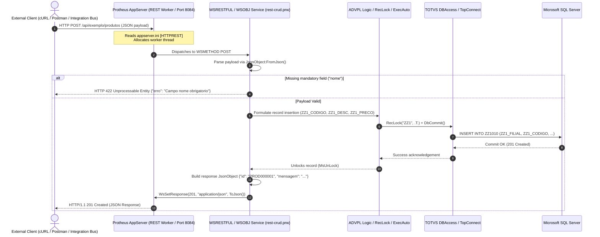

# Protheus REST Lab

[](https://tdn.totvs.com/)
[](https://www.totvs.com/protheus/)
[](https://www.json.org/)
[](https://www.microsoft.com/sql-server)
[](https://opensource.org/licenses/MIT)

A curated laboratory and architectural reference for developing, consuming, and testing **RESTful Web Services** within the **TOTVS Protheus ERP** environment using **ADVPL** and **TL++**.

Covers inbound endpoint hosting (`WSRESTFUL` / `WSOBJ`), outbound HTTP consumption (`FWHttpRest`), robust JSON serialization (`JsonObject`), HTTP status standards, and database persistence.

---

> [!NOTE]
> **Educational & Security Disclaimer**:  
> All routines, schemas, endpoints, table names (`ZZ1`), and sample payloads in this repository are strictly educational and generic. No proprietary customer names, confidential ERP business rules, production IP addresses, or corporate credentials are used.

---

## Architectural Request/Response Lifecycle

The diagram below illustrates how an inbound HTTP request traverses the TOTVS Protheus architecture, executes ADVPL business logic, interacts with the relational database, and returns standard JSON to the consumer.



---

## Architectural Patterns

### 1. Inbound REST Services (Exposing APIs)
- Hosted natively by the Protheus AppServer via `[HTTPREST]` service engine.
- Implemented using `WSRESTFUL` definitions with granular `WSMETHOD` mappings (`GET`, `POST`, `PUT`, `DELETE`).
- Explicit routing through `WsGetUrlParam()`, `WsGetPostContent()`, and status control via `WsSetResponse()`.

### 2. Outbound REST Services (Consuming External APIs)
- Built on `FWHttpRest()` and `FWRest()` native classes.
- Full support for TLS/HTTPS negotiation, custom header injection, and query parameter chaining.
- Multi-scheme authentication handling (HTTP Basic Auth, OAuth2 Bearer Tokens).

### 3. Data Transformation & Serialization
- Safe parsing and extraction utilizing `JsonObject():New()`.
- Explicit type casting (`GetString()`, `GetNumber()`, `GetArray()`).
- Defense against null pointer panics and memory leaks in worker threads.

---

## Repository Structure

```
protheus-rest-lab/
├── README.md
├── .gitattributes
├── .gitignore
└── examples/
    ├── consuming-api/
    │   ├── httpclient-get.prw      # Outbound GET with query params & timeouts
    │   ├── httpclient-post.prw     # Outbound POST sending JSON payloads
    │   └── httpclient-auth.prw     # Outbound Basic Auth & Bearer Token patterns
    ├── exposing-api/
    │   ├── rest-endpoint.prw       # Server health check & environment introspection
    │   └── rest-crud.prw           # Complete CRUD service for generic table ZZ1
    └── json-handling/
        ├── json-parse.prw          # Safe deserialization & nested key navigation
        └── json-build.prw          # Complex JSON construction with arrays & objects
```

---

## API Reference & Payloads

### 1. System Health Status
- **Path:** `/api/exemplo/status`
- **Source:** [`rest-endpoint.prw`](examples/exposing-api/rest-endpoint.prw)

#### Request
```bash
curl -X GET "http://protheus-server:8084/api/exemplo/status" \
  -H "Accept: application/json"
```

#### Response (`200 OK`)
```json
{
  "status": "online",
  "servidor": "APPSERVER_PROD_01",
  "data_hora": "20260916 16:45:10",
  "versao_protheus": "7.00.210324P",
  "ambiente": "ENVIRONMENT_PROD"
}
```

---

### 2. Products CRUD (Table `ZZ1`)
- **Path:** `/api/exemplo/produtos`
- **Source:** [`rest-crud.prw`](examples/exposing-api/rest-crud.prw)

#### List Products (GET)
```bash
curl -X GET "http://protheus-server:8084/api/exemplo/produtos" \
  -H "Accept: application/json"
```

Response (`200 OK`):
```json
{
  "total": 2,
  "produtos": [
    {
      "id": "PROD000001",
      "nome": "Válvula Esférica Industrial 2 Pol",
      "preco": 349.90
    },
    {
      "id": "PROD000002",
      "nome": "Atuador Pneumático Rotativo",
      "preco": 1250.00
    }
  ]
}
```

#### Get Single Product by ID (GET)
```bash
curl -X GET "http://protheus-server:8084/api/exemplo/produtos?id=PROD000001" \
  -H "Accept: application/json"
```

Response (`200 OK`):
```json
{
  "produto": {
    "id": "PROD000001",
    "nome": "Válvula Esférica Industrial 2 Pol",
    "preco": 349.90
  }
}
```

#### Create Product (POST)
```bash
curl -X POST "http://protheus-server:8084/api/exemplo/produtos" \
  -H "Content-Type: application/json" \
  -H "Accept: application/json" \
  -d '{
    "nome": "Sensor de Pressão Digital 4-20mA",
    "preco": 580.00
  }'
```

Response (`201 Created`):
```json
{
  "id": "PROD000003",
  "mensagem": "Produto criado com sucesso"
}
```

#### Update Product (PUT)
```bash
curl -X PUT "http://protheus-server:8084/api/exemplo/produtos?id=PROD000003" \
  -H "Content-Type: application/json" \
  -d '{
    "nome": "Sensor de Pressão Digital 4-20mA Calibrado",
    "preco": 620.00
  }'
```

Response (`200 OK`):
```json
{
  "id": "PROD000003",
  "mensagem": "Produto atualizado com sucesso"
}
```

#### Delete Product (DELETE)
```bash
curl -X DELETE "http://protheus-server:8084/api/exemplo/produtos?id=PROD000003"
```

Response (`200 OK`):
```json
{
  "mensagem": "Produto removido com sucesso"
}
```

---

## HTTP Status Codes & Error Conventions

The laboratory follows standard REST semantics mapped directly into ADVPL response envelopes:

| Status Code | Meaning | When Triggered | Sample Payload |
|---|---|---|---|
| **200 OK** | Success | Entity fetched, updated, or deleted | `{"mensagem": "Produto removido com sucesso"}` |
| **201 Created** | Created | Resource successfully created via `RecLock` | `{"id": "PROD000001", "mensagem": "..."}` |
| **400 Bad Request** | Invalid Input | Mandatory query param (e.g. `id`) omitted | `{"erro": "ID do produto nao informado"}` |
| **404 Not Found** | Not Found | `DbSeek` returns `.F.` for the given key | `{"erro": "Produto nao encontrado"}` |
| **422 Unprocessable** | Semantic Error | Mandatory JSON body attribute missing | `{"erro": "Campo nome obrigatorio"}` |
| **500 Internal Error** | Server Exception | Unhandled runtime error or lock timeout | `{"status": "error", "message": "Falha interna"}` |

---

## Protheus AppServer Configuration (`appserver.ini`)

To enable the REST endpoints in your TOTVS Protheus environment, configure the `[HTTPREST]` section:

```ini
[HTTPREST]
Port=8084
URIs=HTTPURI
Security=0

[HTTPURI]
URL=/api
Instances=2,5
PrepareIn=01,01

[ONSTART]
jobs=HTTPJOB

[HTTPJOB]
main=HTTP_START
environment=ENVIRONMENT_PROD
```

---

## Compiling & Testing

1. **Compilation**: Include the `.prw` source files in your VS Code workspace with TDS (TOTVS Developer Studio) extension or via command line compiler. Compile into your target repository (`RPO`).
2. **Restart REST Service**: Ensure the AppServer REST listener port is active.
3. **Run Validation Tests**: Use the cURL scripts provided above or configure tests via Insomnia/Postman.

---

## License

This project is open source under the [MIT License](LICENSE).
