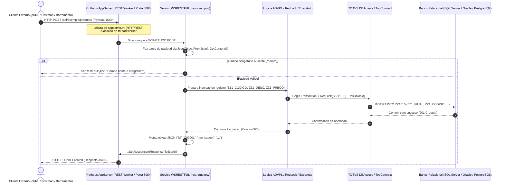

# Laboratório REST Protheus

 

[English](README.md) &nbsp;|&nbsp; **Português (Brasil)**

 

Laboratório e referência arquitetural para desenvolvimento, consumo e testes de **Web Services RESTful** no ecossistema **TOTVS Protheus ERP** utilizando **ADVPL** e **TL++**.

Aborda publicação nativa de rotas (`WSRESTFUL` / `restful.ch`), consumo HTTP outbound (`FWRest`), serialização JSON de alto desempenho (`JsonObject`), códigos de status HTTP padronizados e persistência segura em banco de dados.

---

> [!NOTE]
> **Aviso Educacional & de Segurança**:  
> Todas as rotinas, esquemas, endpoints, tabelas customizadas (`ZZ1`) e cargas de dados de exemplo neste repositório são estritamente educacionais e genéricas. Não há nomes de clientes reais, regras de negócio confidenciais, IPs de produção ou credenciais corporativas.

---

## Ciclo de Vida Arquitetural de Requisição e Resposta

O diagrama abaixo ilustra como uma requisição HTTP percorre a arquitetura do TOTVS Protheus, executa a lógica de negócios em ADVPL, interage com o banco de dados relacional e retorna uma resposta JSON padronizada ao cliente consumidor.

---

## Padrões Arquiteturais

### 1. Serviços REST Inbound (Exposição de APIs)
- Hospedados nativamente pelo Protheus AppServer através da seção `[HTTPREST]` utilizando `#include "restful.ch"`.
- Métodos suportados: `GET`, `POST`, `PUT`, `DELETE` via diretiva `WSMETHOD`.
- Respostas padronizadas com tratamento defensivo de erros via `SetRestFault()`.

### 2. Consumo de APIs Outbound (Cliente REST)
- Implementado através da classe `FWRest`, gerenciando cabeçalhos HTTP, codificação de payloads, autenticação Bearer/Basic e controle de timeouts.

### 3. Manipulação e Serialização JSON
- Estruturação de dados com `JsonObject`, garantindo serialização fluida e segura para estruturas aninhadas e coleções dinâmicas.

---

## Licença

Distribuído sob a licença [MIT](LICENSE).
